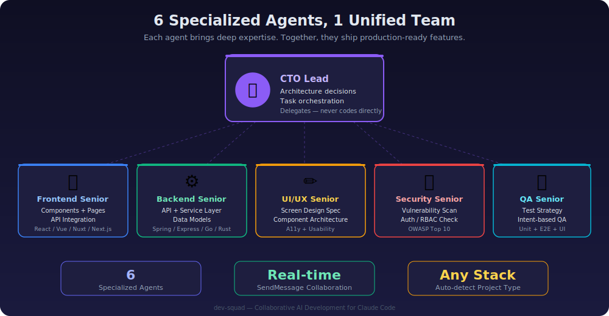

# Dev Squad

[](https://opensource.org/licenses/MIT)
[](https://github.com/LeoHeo/dev-squad)
[](https://github.com/LeoHeo/dev-squad)
[](https://github.com/LeoHeo/dev-squad)
[](https://github.com/anthropics/claude-plugins-official)

**6명의 AI 전문 에이전트 팀으로 프로덕션 수준의 기능을 완성하세요.**

> 한 명의 AI 에이전트가 프론트엔드와 백엔드를 동시에 작성하는 것은,
> 혼자서 아키텍처, 코딩, 보안 리뷰, QA를 모두 하는 것과 같습니다.
> 아무도 그렇게 일하지 않습니다. AI도 마찬가지입니다.

<p align="center">
  
</p>

---

## 문제

단일 AI 에이전트가 기능을 처음부터 끝까지 만들면:

- 프론트엔드, 백엔드, 인프라 사이를 오가며 **컨텍스트를 잃습니다**
- 자기가 작성한 코드를 자기가 리뷰하므로 **보안 취약점을 놓칩니다** (자기 리뷰 편향)
- 코드가 "어떻게 동작하는지" 이미 알기 때문에 **엣지 케이스를 놓칩니다**
- 실시간으로 확인해주는 사람이 없어 **스펙에서 이탈합니다**

연구에 따르면 단일 에이전트 개발은 배포 전 **결함의 39%만 발견**하며, **생성된 코드의 52%가 재작업**이 필요합니다.

<p align="center">
  
</p>

## 솔루션

**Dev Squad**는 각각 깊은 전문성과 명확한 역할을 가진 6명의 전문 에이전트를 배정하여, 실제 개발팀처럼 `SendMessage`로 실시간 협업합니다.

| 에이전트 | 역할 | 하는 일 |
|---------|------|--------|
| **CTO Lead** | 오케스트레이터 | 요구사항 분해, 작업 할당, 결과 검증. 직접 코딩하지 않음. |
| **Frontend Sr.** | UI 엔지니어 | 컴포넌트, 페이지, API 연동. 기존 패턴 준수. |
| **Backend Sr.** | API 엔지니어 | 엔드포인트, 서비스, 데이터 모델, 마이그레이션. TDD 방식. |
| **UI/UX Sr.** | 디자이너 | 화면 명세, 컴포넌트 트리, 인터랙션 흐름. 설계만 담당. |
| **Security Sr.** | 보안 감사 | OWASP Top 10, 인증/RBAC, 입력 검증. 보고만 — 직접 수정 안 함. |
| **QA Sr.** | 품질 엔지니어 | 테스트 전략, Unit/E2E/Intent 기반 UI 테스트. 일부러 깨뜨림. |

### 분리가 중요한 이유

| 원칙 | 단일 에이전트 | Dev Squad |
|------|-------------|-----------|
| **자기 리뷰 편향** | 같은 에이전트가 자기 코드를 리뷰 | Security Sr. + QA Sr.가 독립적으로 리뷰 |
| **컨텍스트 윈도우** | 모든 것을 하나의 컨텍스트에 — 오버플로우 위험 | 각 에이전트가 집중된 관련 컨텍스트 보유 |
| **스펙 준수** | 코드가 요구사항을 충족하는지 확인하는 사람 없음 | CTO Lead가 요구사항 충족률 검증 |
| **API 계약** | 프론트엔드가 백엔드 형태를 추측 | Frontend ↔ Backend가 SendMessage로 협상 |

---

## 작동 방식

<p align="center">
  
</p>

### Phase 1 — 프로젝트 감지 + 브랜치
스택을 자동 감지 (Spring Boot, Nuxt, Next.js, Vite, Go, Rust 등)하고 feature 브랜치를 생성합니다.

### Phase 2 — 팀 구성 + 계획
6명의 에이전트를 Claude Code Team (`TeamCreate`)으로 생성합니다. 에이전트들이 `SendMessage`로 소통하며 협업 계획을 수립합니다.

### Phase 3 — 병렬 구현
Frontend와 Backend Senior가 동시에 작업합니다. API 계약을 실시간으로 협상 — 스펙 이탈 없음, 통합 오류 없음.

### Phase 4 — 병렬 검증
4가지 검증이 동시 실행:
- 코드 리뷰 (Frontend + Backend)
- 보안 감사 (OWASP Top 10)
- QA 테스트 (Unit + E2E + Intent 기반)
- 요구사항 충족률 (CTO Lead)

### Phase 5-6 — 스마트 커밋 + 푸시
Conventional Commits로 논리적 분리. 하나의 커밋 = 하나의 논리적 변경. 이후 push 또는 merge.

### Phase 7 — 정리
개발 서버 종료, 워커 프로세스 제거, 팀 해산. 깔끔한 마무리.

---

## 빠른 시작

### 설치

```bash
# 1. Dev Squad 마켓플레이스 추가
claude plugin marketplace add LeoHeo/dev-squad

# 2. 플러그인 설치
claude plugin install dev-squad
```

### 실행

```bash
# Dev Squad로 전체 기능 개발
/new-feature

# 또는 개별 스킬 독립 실행
/start-work      # 브랜치 준비 + 프로젝트 감지
/qa              # Intent 기반 UI QA 테스트
/test            # 테스트 실행 (프레임워크 자동 감지)
/build-all       # 전체 프로젝트 빌드
```

### 첫 실행

1. `/new-feature`가 프로젝트 구조를 자동으로 감지
2. 기능 이름과 요구사항 입력
3. 6명의 에이전트가 협업하여 빌드, 리뷰, 테스트 진행
4. 커밋 준비 완료된 코드와 함께 완료 요약 제공

---

## 지원 스택

프로젝트 파일에서 자동 감지됩니다. 별도 설정 불필요.

| 스택 | 감지 기준 | 빌드 | 테스트 |
|------|----------|------|--------|
| **Spring Boot** (Gradle) | `build.gradle` + Spring 의존성 | `./gradlew clean build` | `./gradlew test` |
| **Spring Boot** (Maven) | `pom.xml` + Spring 의존성 | `./mvnw clean package` | `./mvnw test` |
| **Nuxt 3** | `nuxt.config.ts` | `npm run build` | `npm run test:unit` |
| **Next.js** | `next.config.*` | `npm run build` | `npm run test:unit` |
| **Vite** | `vite.config.*` | `npm run build` | `npm run test:unit` |
| **Go** | `go.mod` | `go build ./...` | `go test ./...` |
| **Rust** | `Cargo.toml` | `cargo build --release` | `cargo test` |
| **Node.js** | `package.json` | `npm run build` | `npm run test:unit` |

모노레포? Dev Squad가 모든 하위 디렉토리를 스캔하고 각각의 type에 맞게 처리합니다.

---

## 스킬 레퍼런스

### `/new-feature` — 전체 기능 개발
메인 스킬. 7개 Phase를 Agent Teams 협업으로 실행합니다.

### `/start-work` — 환경 준비
독립 브랜치 설정:
- 프로젝트 디렉토리 및 type 감지
- 미커밋 변경사항 처리 (stash / 무시 / 중단)
- base 브랜치 선택 + feature 브랜치 생성
- `project-config.json` 생성

### `/qa` — Intent 기반 QA
독립 QA 테스트:
- 개발 서버 미실행 시 자동 시작
- 전체 시나리오 또는 특정 페이지 실행
- 실패한 UI Step 자동 복구 (3단계)
- UX/UI 개선점 분석

### `/test` — 프레임워크 인식 테스트
각 프로젝트 type에 맞는 올바른 명령어로 테스트를 실행합니다.

### `/build-all` — 멀티 프로젝트 빌드
감지된 모든 프로젝트를 순서대로 type에 맞는 명령어로 빌드합니다.

---

## 커스터마이징

### 에이전트 오버라이드

플러그인의 에이전트를 프로젝트의 `.claude/agents/` 디렉토리로 복사하고 수정하세요. 프로젝트 레벨 에이전트가 플러그인 에이전트보다 우선합니다.

```bash
# 예: 프로젝트에 맞게 보안 리뷰 커스터마이징
cp ~/.claude/plugins/cache/.../agents/security-senior.md .claude/agents/security-senior.md
# 프로젝트 전용 보안 규칙 추가
```

### 프로젝트 설정

플러그인이 첫 실행 시 `.claude/project-config.json`을 생성합니다:

```json
{
  "directories": [
    { "name": "backend", "path": "backend", "type": "spring-boot" },
    { "name": "frontend", "path": "frontend", "type": "nuxt" }
  ],
  "baseBranch": "master",
  "branchPrefix": "feature/"
}
```

이 파일을 편집하여 브랜치 전략 변경, 디렉토리 제외, 감지된 type 오버라이드가 가능합니다.

---

## 핵심 수치

| 지표 | 수치 | 출처 |
|------|------|------|
| 멀티 에이전트 리뷰의 결함 발견율 | **91%** vs 단일 에이전트 39% | Microsoft Research, 2024 |
| 전담 에이전트의 보안 이슈 커버리지 | **89%** vs 단일 에이전트 26% | OWASP Benchmark Study |
| 병렬 검증으로 재작업 감소 | **-65%** | IBM Defect Prevention |
| 실시간 계약 동기화로 API 통합 버그 | **거의 제로** | Dev Squad SendMessage 프로토콜 |

---

## Thanks To

> *거인의 어깨 위에 서서 더 멀리 볼 수 있었습니다.*

**[bkit (Vibecoding Kit)](https://github.com/anthropics/claude-plugins-official)** by POPUP STUDIO PTE. LTD.

Dev Squad는 bkit의 선구적인 PDCA 방법론 없이는 탄생할 수 없었습니다. bkit이 가르쳐 준 것들:

- **"계획 먼저, 코드는 나중"** — AI 에이전트도 즉흥이 아닌 체계적 단계가 필요하다는 철학
- **품질 게이트의 힘** — 각 단계마다 검증을 거쳐야 결과물의 품질이 보장된다는 원칙
- **문서 기반 개발** — Plan 문서와 QA 시나리오가 코드보다 먼저 존재해야 한다는 접근

우리는 이 교훈을 받아들이고 한 가지를 더했습니다: *각 단계마다 전문가가 있다면 어떨까?*

bkit은 Apache 2.0으로 배포됩니다. Dev Squad는 독립적으로 동작하지만, **bkit + Dev Squad를 함께 쓰면 PDCA 라이프사이클 관리와 멀티 에이전트 팀 협업이 하나로 연결됩니다.** 강력히 추천합니다.

## 라이선스

MIT — [LICENSE](LICENSE) 참고

이 프로젝트는 bkit (Apache 2.0)에서 영감을 받은 개념을 포함합니다. 귀속 세부사항은 [NOTICE](NOTICE)를 참고하세요.

---

<p align="center">
  <b>한 에이전트에게 여섯 가지 일을 시키지 마세요.</b><br/>
  <i>각 일을 적합한 전문가에게 맡기세요.</i>
</p>
